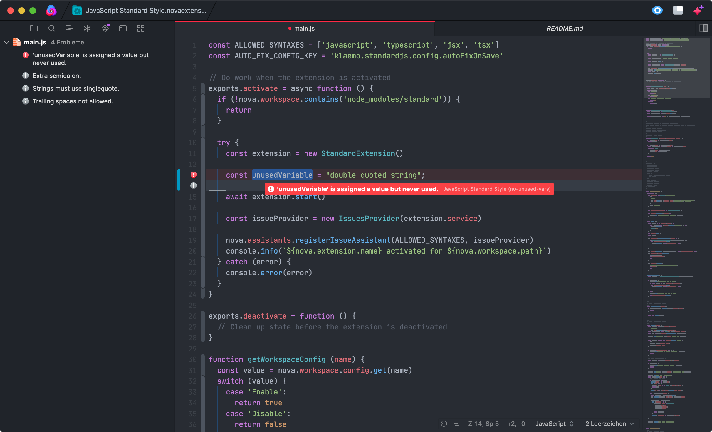

<!--
👋 Hello! As Nova users browse the extensions library, a good README can help them understand what your extension does, how it works, and what setup or configuration it may require.

Not every extension will need every item described below. Use your best judgement when deciding which parts to keep to provide the best experience for your new users.

💡 Quick Tip! As you edit this README template, you can preview your changes by selecting **Extensions → Activate Project as Extension**, opening the Extension Library, and selecting "JavaScript Standard Style" in the sidebar.

Let's get started!
-->

<!--
🎈 Include a brief description of the features your extension provides. For example:
-->

**JavaScript Standard Style** automatically lints all open files, then reports errors and warnings in Nova's **Issues** sidebar and the editor gutter:

<!--
🎈 It can also be helpful to include a screenshot or GIF showing your extension in action:
-->

It also includes a `Fix all auto-fixable issues` command that can be invoked through the command palette.

## Requirements

<!--
🎈 If your extension depends on external processes or tools that users will need to have, it's helpful to list those and provide links to their installers:
-->

JavaScript Standard Style requires some additional tools to be installed on your Mac:

- a recent [Node.js](https://nodejs.org) version that's supported by [standardJS](https://standardjs.com)
- `standard` has to be installed **locally** in your workspace. This extension will not use any globally installed `standard` installations. If this is something you want, feel free to open an issue or PR.

<!--
✨ Providing tips, tricks, or other guides for installing or configuring external dependencies can go a long way toward helping your users have a good setup experience:
-->

> To install the current stable version of Node, click the "Recommended for Most Users" button to begin the download. When that completes, double-click the **.pkg** installer to begin installation.

### Configuration

<!--
🎈 If your extension offers global- or workspace-scoped preferences, consider pointing users toward those settings. For example:
-->

To configure global preferences, open **Extensions → Extension Library...** then select JavaScript Standard Style's **Preferences** tab.

You can also configure preferences on a per-project basis in **Project → Project Settings...**

**Available options:**

- Enable auto-fix on save

<!--
👋 That's it! Happy developing!

P.S. If you'd like, you can remove these comments before submitting your extension 😉
-->

### Credits

Lots of inspiration was drawn from these sources:

- [Nova Prettier Extension](https://github.com/alexanderweiss/nova-prettier) by [Alexander Weiss](https://github.com/alexanderweiss)
- [Nova ESLint Extension](https://github.com/apexskier/nova-eslint) by [Cameron Little](https://github.com/apexskier)
